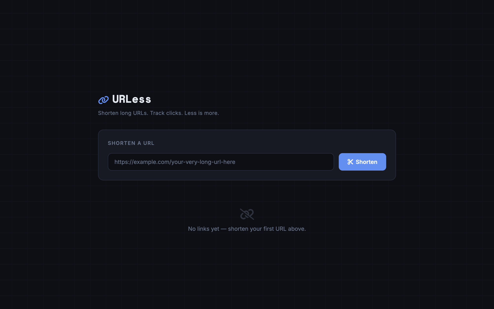
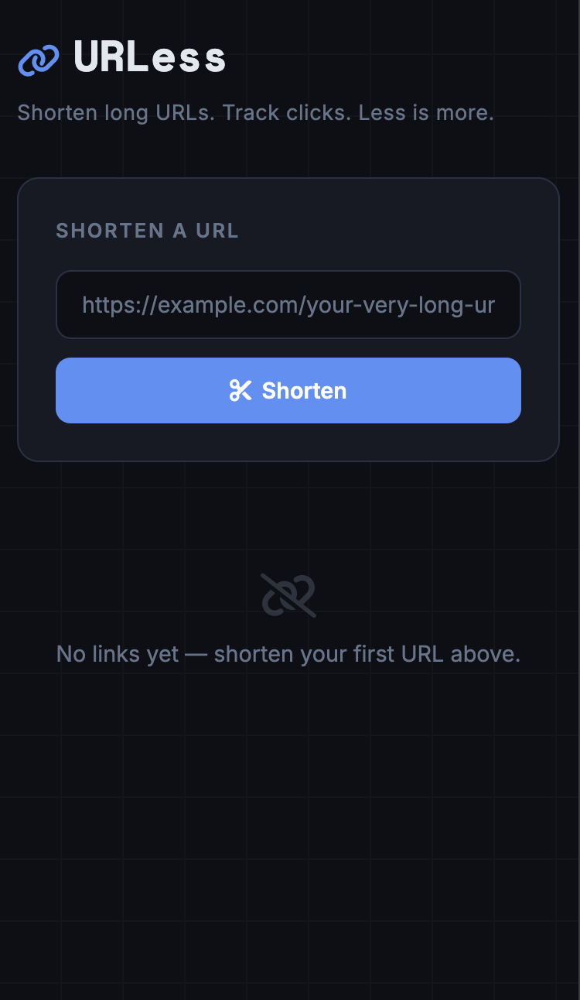

# URLess - Laravel App

**Less is more.** A clean, minimal URL shortener built with Laravel. Paste a long URL, get a short link, and track clicks — all from a single dark-themed dashboard.

---

## Features

- **Shorten URLs** — Submit any valid URL and receive a unique 6-character short code
- **Click Tracking** — Every redirect increments a click counter so you can see how your links perform
- **One-Click Delete** — Remove any link instantly from the dashboard
- **Responsive Design** — Desktop table view automatically switches to a mobile-friendly card layout on small screens

---

## Screenshots

 | Desktop | Mobile |
 |---------|--------|
 |  |  |

---

## Installation

### Prerequisites

- PHP 8.3+
- Composer
- Node.js & npm
- A database (SQLite works out of the box)

### Steps

```bash
# Clone the repository
git clone https://github.com/your-username/urless.git
cd urless

# Install PHP dependencies
composer install

# Copy environment file and generate app key
cp .env.example .env
php artisan key:generate

# Create the SQLite database (or configure another driver in .env)
touch database/database.sqlite

# Run migrations
php artisan migrate

# Install front-end dependencies and compile assets
npm install
npm run build
```

### Development

Start all services (web server, queue, logs, and Vite) simultaneously:

```bash
composer dev
```

Or start them individually:

```bash
php artisan serve   # Laravel dev server
npm run dev         # Vite dev server with HMR
```

The app will be available at `http://localhost:8000` (or your configured Herd domain).

---

## Usage

1. **Shorten** — Enter a URL in the input field and click **Shorten**
2. **Share** — Copy the generated short link from the dashboard table
3. **Track** — Watch the click count update each time someone visits the short link
4. **Delete** — Click the trash icon to remove a link you no longer need

---

## Important Hooks & Functions

### Routes (`routes/web.php`)

| Method   | URI               | Action                    | Description                        |
|----------|-------------------|---------------------------|------------------------------------|
| `GET`    | `/`               | `LinkController@index`    | Display the dashboard with all links |
| `POST`   | `/links`          | `LinkController@store`    | Validate & create a new short link |
| `DELETE` | `/links/{link}`   | `LinkController@destroy`  | Delete a link                      |
| `GET`    | `/{short_code}`   | `LinkController@redirect` | Redirect to original URL & increment clicks |

### LinkController (`app/Http/Controllers/LinkController.php`)

- **`index()`** — Fetches all links ordered by latest and passes them to the view
- **`store(Request $request)`** — Validates the URL, generates a random 6-char short code via `Str::random(6)`, and creates the link record
- **`redirect($short_code)`** — Looks up the short code, calls `$link->increment('clicks')` to atomically bump the counter, and redirects away
- **`destroy(Link $link)`** — Uses route model binding to resolve and delete the link

### Link Model (`app/Models/Link.php`)

- **`$fillable`** — Mass-assignable fields: `original_url`, `short_code`, `clicks`
- Database columns: `id`, `original_url`, `short_code` (unique), `clicks` (default 0), `timestamps`

### Key Laravel Features Used

- **`Str::random()`** — Generates the unique short code
- **`$model->increment()`** — Atomic click counter update (no race conditions)
- **Route Model Binding** — Automatic model resolution in `destroy()` 
- **`@vite()` Blade Directive** — Loads Vite-compiled CSS/JS assets
- **CSRF Protection** — `@csrf` directive on all forms
- **Flash Sessions** — `session('success')` for post-action feedback messages
- **Validation** — Server-side `required|url` validation on submissions

---

## Technologies

| Layer       | Technology                                                        |
|-------------|-------------------------------------------------------------------|
| Framework   | [Laravel 13](https://laravel.com)                                 |
| Language    | PHP 8.3+                                                          |
| Database    | SQLite (default) — supports MySQL, PostgreSQL, etc.               |
| Frontend    | Blade templates, [Tailwind CSS 4](https://tailwindcss.com)        |
| Build Tool  | [Vite 8](https://vitejs.dev) with [Laravel Vite Plugin](https://github.com/laravel/vite-plugin) |
| Icons       | [Font Awesome 6](https://fontawesome.com)                         |
| Fonts       | [Inter](https://rsms.me/inter/), [Space Mono](https://fonts.google.com/specimen/Space+Mono) |
| Testing     | [Pest](https://pestphp.com)                                       |

---

## License

This project is open-sourced software licensed under the [MIT License](https://opensource.org/licenses/MIT).

---

## Author

**Joshua Ayala**  
[joshuaayala.com](https://joshuaayala.com) · 
[GitHub](https://github.com/joshayala) · 
[LinkedIn](https://www.linkedin.com/in/joshuaayala-dev)
